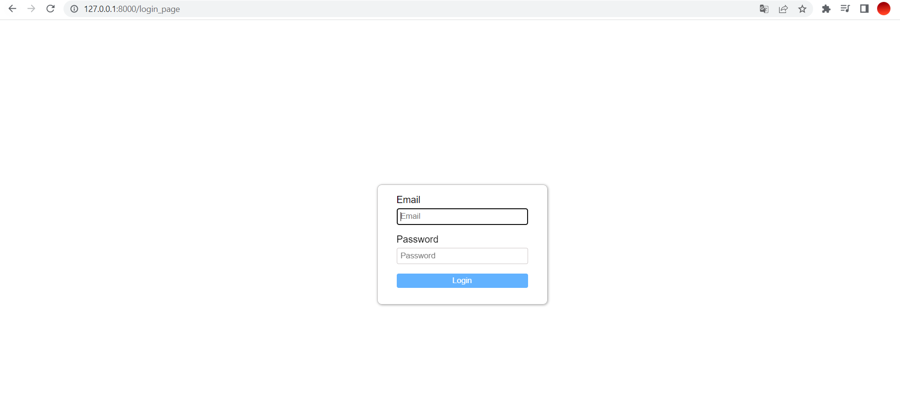

# This is simple app build with vue 2 in client side and django 4.0.4 contains:
* A login interface where we use email and password to connect
* A main interface with list of tasks
* We can create a new task and add it in server 
* delete a item or change its state
* Filter tasks
* clear all tasks

## Image of the login interface 

## Image of the main interface where Tasks appear 
